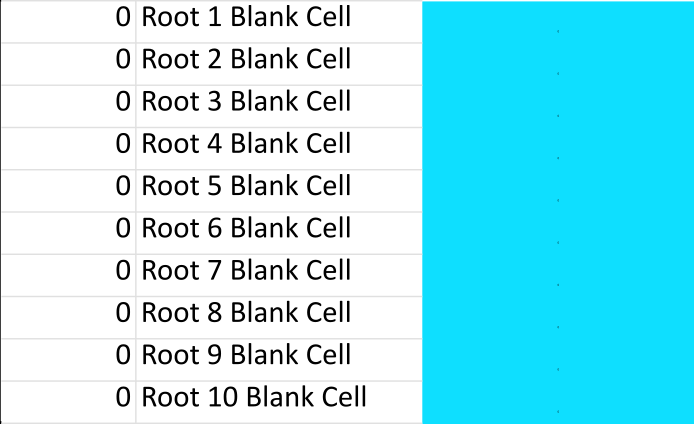

<!-- README.md is generated from README.Rmd. Please edit that file -->

```{r, include = FALSE}
knitr::opts_chunk$set(
  collapse = TRUE,
  comment = "#>",
  fig.path = "man/figures/README-",
  out.width = "100%"
)
```

# AMReader

<!-- badges: start -->
<!-- badges: end -->

## About

AMReader is an R package that partners with AMScorer
to enable easy quantification of root length colonisation by arbuscular
mycorrhizal (AM) fungi, followed by simple data analysis and visualisation.

AMScorer is also distributed with this package and is an excel
spreadsheet designed for easy data input alongside microscropy. It has multiple
functions intended to enable rapid and accurate data input - ending any
dependence on paper, and saving significant data processing time.

AMReader can read AMScorer to instantly perform
relevant statistical analyses and data visualisation. Multiple user inputs are
built into this function to enable the user to tailor their statistical analyses
and graphical outputs. It is raw data to personalised results in a single 
function.

## Installation

Both AMReader and AMScorer can be downloaded from the 
GitHub repository: EJarrattBarnham/AMReader available at:
https://github.com/EJarrattBarnham/AMReader

To download the excel spreadsheet, select “AMScorer.xlsx” 
from the file list then “Download”.

To download AMReader:

```{r Installation_Guide, echo = TRUE, eval = FALSE}
install.packages("devtools")
devtools::install_github("EJarrattBarnham/AMReader")
```

This requires the R library "devtools". If having difficulty installing it, 
try updating the R version you are using to the latest version.

## Citation

A paper is currently in development.

## In Development

A version of AMScorer which enables concurrent quantification of combinations of 
fungal structures in the same field of view

## Contents

This README provides information on how to use:

1) AMScorer

2) AMReader

## AMScorer

AMScorer is designed to be used alongside the R package 
AMReader, however it can also be used independently.

### *Introduction*

This spreadsheet was developed to aid the collection of data from arbuscular 
mycorrhizal (AM) root colonisation assays. It is designed to enable rapid data 
collection, and easy conversion of that data into a graphical representation 
and statistical outputs.

This spreadsheet contains 26 sheets (A to Z), each of which contains 15 counting 
tables (Figure 1). Any data input into these is fed into the "AM Results" table, 
which forms this spreadsheet's main output. It is also required that metadata 
detailing the experimental design given in the “Conditions” sheet (which may 
include information about the genotype, time points, nutrient treatments etc.). 
Each “Condition” should be given a unique letter in this table. 

```{r Figure 1, echo = FALSE, dpi = 1200, fig.cap = "Figure 1. A counting table"}

```

In the first instance, therefore, this spreadsheet enables the counting of 
up to 15 replicates of 26 conditions. However, it is possible to extend this 
with the “Blinds” sheet (see section on the “Use of Blinds”) to count a 
total of 390 plants and a maximum of 78 different conditions (5 replicates per 
plant in this case), or any other distribution of 390 plants that is desired. 
It is anticipated that few experiments would exceed this requirement and, if so,
multiple copies of this spreadsheet might be complied post-hoc for data
analysis.

This spreadsheet also contains a “Test” sheet, which contains 15 counting 
tables. These results do not form part of any output. If monitoring the 
colonisation levels of an experiment prior to harvesting, this is a suitable 
place to record these colonisation data.

Additionally, there is an “Information + Warnings” tab which helps the user 
reduce the risk of errors in their data recording.

To prevent unintentional changes to the spreadsheet, there is "password" 
protection. This prevents any cell not intended to be edited from being changed. 
This can be deactivated by selecting: Home -> Format -> Unprotect sheet.
There is no password – just hit enter. Once any changes are made, 
it is advised you reinstate the password protection.

It is also advised you keep an entirely unaltered copy of the Master Spreadsheet 
stored and create a duplicate copy for each experiment.

### *Counting root colonisation*

It is our standard approach to record 10 fields of view (at 200 x total 
magnification) from 10 root pieces per plant. The presence or absence (1 or 0) 
of Extraradical Hyphae, Hyphopodia, Intraradical Hyphae, Arbuscules, Vesicles 
and Spores is recorded.

Using these observations, it is possible to quantify the total percentage of 
colonised root, labelled “Total”, which records the presence of at least one 
internal structure (Hyphopodia, Intraradical Hyphae, Arbuscules and Vesicles). 
A count towards “Non” is made if there is no internal structure present. “Total”
and “Non” are calculated automatically.

Below is an example of the table for one root piece (Figure 2). This is repeated
10 times per plant.

```{r Figure 2, echo = FALSE, dpi = 1200, fig.cap = "Figure 2. Data from one root piece"}

```

### *Data input*

1)	In the "Information + Warnings" tab, fill in the information above the black 
line with your name and the experiment name.
2)	In the "Conditions" tab, insert information about the genotype and growth 
condition. It is not necessary to give a description for every letter.
3)	Go to sheet “A”.
4)	From the top-left, open the drop down "named range" menu and select _01 
(Figure 3). This will specifically select the boxes to insert the data (see 
image below for guide). This enables easy data input and is a key feature of 
this spreadsheet.

```{r Figure 3, echo = FALSE, dpi = 1200, out.width="75%", out.height="75%", fig.cap = "Figure 3. Finding the named range"}

```

5)	Counting AM colonisation.

To input data, few buttons on a keyboard are necessary:

+ 1: To indicate the presence of that fungal structure.

+ TAB: To move to the next cell in the selection (made in step (4) above).

+ SHIFT + TAB: To move back to the previous cell.

+ 0: To correct the spreadsheet if you have incorrectly inserted a 1.

On UK/US keyboards, these buttons are all in easy reach with one hand 
(the left hand is easiest). As most microscopes are set up for use of the 
right hand to adjust slide positioning, it is advised you use your left hand 
to input data while you use your right hand to control the microscope. With 
practice, it is possible to operate this spreadsheet in the corner of 
your eye. To aid this, cells with “1” in them will go blue.

It is **not** possible to insert values into the counting tables other than 
0 and 1. If you do, a pop-up warning will appear. To close the warning, you 
can press TAB followed by SPACE or ENTER (or use the cursor to select cancel). 
This will return the cell to its previous value. 

It **is** possible to accidentally delete a value in a cell. If this happens, 
the cell will go red to highlight that an error has been made.

6)	After completing a slide, move on to the next slide of that "condition". To 
do this, select from the top left drop down menu “_02”. This will select the 
next set of cells. Repeat until all replicates of the given condition are filled 
in.
7)	Once all biological replicates of "A" are complete, move on to sheet "B" for 
the next condition.

### *Counting arbuscules and vesicles as intraradical hyphae*

Depending on the species and staining quality, it can often be challenging to 
see intraradical hyphae, though their presence can be assumed by the presence of 
other fungal structures such as arbuscules and vesicles. Additionally, some 
researchers consider arbuscules and vesicles as a type of intraradical hypha. 
This has led to some variability as to whether researchers wish to include a 
count for intraradical hyphae when they observe arbuscules or vesicles for the 
purposes of AM colonisation assays. This spreadsheet has therefore been designed
to enable easy conversion between the two modes of counting. Under the 
“Information + Warnings” sheet there is a line “Arbuscules/Vesicles count As 
Intraradical Hyphae. 1 = YES, 0 = NO”. By submitting “1” into the corresponding 
box, every field of view containing an arbuscule or vesicle will contribute 
towards the overall count of intraradical hyphae. By submitting “0”, only the 
times where a “1” is input in the intraradical hypha column will be counted. 
As such, if the user ensures they count only what you observe, you can decide 
to change the intraradical hypha count with a simple switch.

### *Registering the absence of any fungal structures*

In the data analysis stages, slides without any fungal counts are excluded. When 
counting slides that have no fungus present, this is undesirable. In the event 
you wish to record a slide that had absolutely no fungal structures, a “No 
Fungus Override” button (Figure 4) is found on the right-hand side of the 
counting table. Insert 1 to activate this. Only do this if you want a slide with 
no fungus to be included in the final results.

```{r Figure 4, echo = FALSE, dpi = 1200, out.width="50%", out.height="50%", fig.cap = "Figure 4. The No Fungus Override Button"}

```

### *Warnings*

In our experience, few errors are made during counting, and these are easily 
noticed and readily fixed. However, to ensure that no errors are made, the 
spreadsheet monitors certain foreseeable errors. 

Each counting table monitors whether there are: 

1) Any blank cells in the spreadsheet (Counting tables)

Accidentally deleting a value from a cell is an indication of a potential 
error. If this has occurred, the affected cell will go red, and on the 
right-hand side of the table, the blank cell warning will activate to 
highlight which root is affected (Figure 5).

```{r Figure 5, echo = FALSE, dpi = 1200, out.width="50%", out.height="50%", fig.cap = "Figure 5. The Blank Cell warning"}

```

2) A suspiciously low colonisation count (Counting tables)

It is feasible that, by mistake, a “1” may be inserted into a table that is not 
intended to be counted. This would lead to the inclusion of these data 
in the final results. This needs to be avoided. Therefore the “Too Few Counts”
warning will activate if:

  * Case 1
    + Total colonisation is between 1 and 4.    
    AND 
    + The sum of extraradical hyphae and spores is less than 4.

  * Case 2
    + Total colonisation is less than 4.        
    AND 
    + The sum of extraradical hyphae and spores is less than 4.    
    AND 
    + Either extraradical hyphae or spores are greater than 0.

The Too Few Counts warning will therefore catch any accidental inputs of data 
(Figure 6).

```{r Figure 6, echo = FALSE, dpi = 1200, out.width="50%", out.height="50%", fig.cap = "Figure 6. The Too Few Counts warning"}

```

3) No Fungus override (Counting tables)

The ability to count a slide as having no fungus may be useful, but would 
potentially risk inadvertently including “uncolonised” plants in the output for 
plants that don’t actually exist. If the “No Fungus Override Active” switch 
is set to 1, it also activates the “no fungus override” warning (Figure 7).

```{r Figure 7, echo = FALSE, dpi = 1200, out.width="50%", out.height="50%", fig.cap = "Figure 7. The No Fungus Override Active warning"}

```

4) Blind Grading active (Information + Warnings Tab)

If blind grading is active, it is possible that the final results will be 
altered (see the blind grading section for more information). To ensure this is 
intended, there is a warning turned on if Blind Grading is active (Figure 8).

```{r Figure 8, echo = FALSE, dpi = 1200, out.width="50%", out.height="50%", fig.cap = "Figure 8. The Blind Grading Active warning"}

```

### *Information + Warnings Sheet*

If there is any error predicted by the spreadsheet, the “Global Warning” box 
will go red (Figure 9). The adjacent list of slides will identify the source
of the possible error. In the example below, there is an potential error found 
in slide A1.

```{r Figure 9, echo = FALSE, dpi = 1200, fig.cap = "Figure 9. The Global Warning"}

```

In the case that there are warnings present, it is advised that you check each 
counting table to determine the cause of the error. If you determine that the 
error is a false alarm you can deactivate the warning displayed in Figure 9 by 
informing the spreadsheet that this slide is OK. To do so, insert a “1” into the 
relevant cell in the “Exemptions” grid (Figure 10).

```{r Figure 10, echo = FALSE, dpi = 1200, fig.cap = "Figure 10. The Warning Excemptions grid"}

```

The Information + Warnings sheet will also let you check which slides have been 
counted and are contributing to the data (Figure 11).

```{r Figure 11, echo = FALSE, dpi = 1200, fig.cap = "Figure 11. The Counted Slides grid"}

```

Finally, there is also a section to identify which slides have 
“No Fungus Override” active, so you can easily check these are as you expect 
(Figure 12).

```{r Figure 12, echo = FALSE, dpi = 1200, fig.cap = "Figure 12. Slides with No Fungus Override grid"}

```

### *Blinds*

It is preferred, and sometimes necessary, for researchers to quantify AM 
colonisation blind, so as to exclude unconscious bias in their count, or when 
the genotypes etc. are yet to be determined. To facilitate this, the spreadsheet
comes with a “Blinds” sheet (Figure 13). The only column for the user to edit is 
“Slide (Real) – Specify”. This will give the “true” value of the slide. “Slide 
(Blind)” records the value of the slide counted as it was named when counting 
blind. E.g. A researcher may count slide “A1”, then later learn that it 
belongs to condition “B”. Therefore, put “B” in the “Slide (Real) – Specify” 
column in the row where “Slide (Blind)” states “A1”. Adding numbers is optional, 
as the “Condition (Real)” column will remove any numbers from the “Slide (Real) 
– Specify” column, and this is the data fed into the AM Results table. 
Acceptable values for the “Slide (Real) – Specify” column are the letters A-Z, 
AA-AZ and BA-BZ (and any numbers desired).

```{r Figure 13, echo = FALSE, dpi = 1200, fig.cap = "Figure 13. The Blinds Sheet"}

```

If using the “Blinds” sheet, ensure that the “Activate blind scoring” switch 
(see Figure 13) is set to 1. You can also check the AM Results table to confirm 
that it is operating correctly.

#### *Blinds – going beyond 26 conditions and 15 replicates*

In effect, the “Blinds” sheet informs the output as to which slides are from the
same condition. The number of the slide is ultimately not significant. As this
allows the sheet to group any set of slides, it is therefore possible to break
beyond the 26 different conditions implied by the sheets being labelled A-Z. All
15 replicate tables from each sheet A-Z can be used, and subsequently, with the
“Blinds” sheet, they can be grouped independently into up to 78 different
conditions (A-Z, AA-AZ, BA-BZ), which can then be named in the “Conditions” tab.
This also enables you to count more than 15 replicates of a single condition, 
as all the counting tables in “B” could be grouped into “A”, by giving them this
letter in the “Blinds” tab.

### *The Output – AM Results*

All the data input into this spreadsheet are compiled in the “AM Results” table 
(Figure 14).

```{r Figure 14, echo = FALSE, dpi = 1200, fig.cap = "Figure 14. The AM Results table"}

```

When a slide has been counted, the “Counted” column become 1 and the line goes 
blue.

### *The Output – Conditions*

The “Conditions” tab carries the metadata for the “AM Results” tab. Here, you 
can specify the Condition, Facet_1, Facet_2, Facet_3 and Manual_Colour metadata.
An example is given in Figure 15. In this hypothetical experiment there are
three different genotypes – WT and mutants 1 and 2. These are listed in the 
“Condition” column. This experiment tested these genotypes at two different time
points (7 weeks and 5 weeks), two different nutrient conditions (Nutrient 1 and 
Nutrient 2), and two types of inoculum (Inoculum 1 and Inoculum 2) – these are 
listed in Facet_1, Facet_2 and Facet_3. See “Examples” for illustrations of how 
this is represented in the final output. Additionally, the “Manual_Colour” tab 
has been filled in with colour codes that are acceptable inputs in R’s 
scale_fill_manual() function. These can be hexcodes or any colour listed by the
color() function.

```{r Figure 15, echo = FALSE, dpi = 1200, out.width="75%", out.height="75%", fig.cap = "Figure 15. The Conditions table"}

```

## AMReader

The R package AMReader has been designed to:

1)	Read the “AM Results” and “Conditions” tabs from the AMScorer
and process these data.

2)	Perform basic statistical analysis.

3)	Produce a graph displaying colonisation percentages. 

The goal is to enable the user easy data analysis. Unfortunately, not *all* user 
preferences are foreseeable. Consequently, the data tables generated by 
AMReader are saved to the global environment, allowing the user 
to conduct their own statistical analyses, and produce their own figures. 
Additionally, the "Plot" object is also saved to the global environment,
allowing the user to fine tune this output, as with any other ggplot object.

There are many parameters in this function, which relate to the three stages 
listed above. See the “Parameters for” sections below and the 
AMReader documentation. See "Examples" for examples of how they
are employed.

### *Data Processing*

AMReader extracts data from the AM Results and Conditions tab 
of the excel file. The user is required to provide the "Path" and "File_Name" of
AMScorer. 

Any slide that has not been counted is excluded from the results.

It may be the user’s preference to include only a subset of the conditions
counted in their experiment during statistical analysis and graph production. 
They can select these using the "Condition_Include" or "Condition_Exclude" 
parameters.

It may also be the user’s preference to include only a subset of the 
structures counted in their experiment during statistical analysis and graph 
production. They can select these using the "Structure_Include" or 
"Structure_Exclude" parameters.

The user also specifies which Facets to include in the data processing 
(using "Facet_1", "Facet_2" and "Facet_3"). In the example from Figure 15, 
letter code “A” will therefore refer to “WT 7 weeks Nutrient 1 Inoculum 1”. This
is important for statistical analysis and graph production.

The key output of these steps is the “Filtered_Dataset”, which is saved to the 
global environment for the user.

#### *Parameters for Data Processing*

The following parameters are important for the Data Processing stages, and may
affect the Filtered_Dataset output. Consequently, they also play a role in the 
Statistical Analysis and Graph Production stages.

  * Experiment_Name

    + Choose the Experiment_Name.
    + This is not essential but can play a role at a number of stages:
      - Data import: The default "File_Name" is "AMScorer 
      {Experiment_Name}.xlsx", where {Experiment_Name} is set by the input 
      of "Experiment_Name". This gives a quick way of loading the AMScorer
      without needing to specify the full name of the document.
      - Statistical Analysis output: The default output name is "Statistical 
      Analysis {Experiment_Name}.xlsx", where {Experiment_Name} is set by the 
      input of "Experiment_Name". This can allow the output to have a unique tag
      that refers to the experiment it came from.
      - Graph Production output: The default output name is "Colonisation 
      Percentage Graph {Experiment_Name}.png", where {Experiment_Name} is set by
      the input of "Experiment_Name". This can allow the output to have a unique 
      tag that refers to the experiment it came from.

  * Path

    + Set the Path to the folder containing your filled in 
    AMScorer.
    + Any outputs (Statistical Analysis or Graph) will be directed here also.

  * File_Name

    + Identify the name of the AMScorer file to import.
    + Defaults to "AMScorer {Experiment_Name}.xlsx", where 
    {Experiment_Name} is set by the input of "Experiment_Name".

  * Condition_Include

    + Select certain conditions from the data before statistical analysis and 
    graph production.
    + The input is a list of letter codes referring to the conditions to keep in 
    the dataset. E.g. Condition_Include = c(“A”, “C”, “F”) will proceed with 
    only the data from conditions A, C and F.
    + Cannot be used at the same time as Condition_Exclude.

  * Condition_Exclude

    + Remove certain conditions from the data before statistical analysis and 
    graph production. 
    + The input is a list of letter codes referring to the conditions to remove 
    from the dataset. E.g. Condition_Exclude = c(“B”, “D”, “E”) will exclude any 
    data from conditions B, D and E.
    + Cannot be used at the same time as Condition_Include
    
  * Structure_Include

    + Select certain structures from the data before statistical analysis and 
    graph production.
    + The input is a list of codes referring to the structures to keep in 
    the dataset. E.g. Structure_Include = c(“A”, “V”) will proceed with 
    only the data concerning the abundance of arbuscules and vesicles.
    + Cannot be used at the same time as Structure_Exclude

  * Structure_Exclude

    + Remove certain structures from the data before statistical analysis and 
    graph production. 
    + The input is a list of  codes referring to the structures to remove 
    from the dataset. E.g. Condition_Exclude = c(“EH”, “IH”, “S”) will exclude 
    the data concerning extraradical hyphae, intraradical hyphae and spores.
    + Cannot be used at the same time as Structure_Include

  * Facet_1, Facet_2 and Facet_3

    + Inform the function of which facets to take from the Conditions sheet.
    + Options are TRUE or FALSE (default).
    + **Please note:** If there are two "Condition" values which are identical,
    as is the case in Figure 15, and the relevant facets are not activated, this
    will result in all the "WT" conditions being clumped together, ignoring the
    fact they are not identical. This will mean the the statistics and graph are
    (likely) meaningless.

### *Statistical Analysis*

By default, AMReader performs no statistical analysis and proceeds
straight to producing the graphical output, however AMReader is 
capable of conducting multiple statistical tests: ANOVA, TukeyHSD, 
Kruskal-Wallis, Dunn and pairwise Wilcoxon tests. These tests can be used 
to provide additional information on the graphical output and may also be saved 
to a “Statistical Analysis.xlsx” output that summarises all these results.

**Please note:** The statistical tests performed by AMReader are 
intended to assist the user, but it is not guaranteed that they will be the 
most appropriate statistical test for the user’s experimental design. 

AMReader uses the following R functions for the statistical 
tests:

  + ANOVA – aov()
  + TukeyHSD – TukeyHSD()
  + Kruskal-Wallis - kruskal.test()
  + Dunn Test – DunnTest()
  + Pairwise Wilcoxon Tests - pairwise.wilcox.test()

It is recommended the users familiarise themselves with these functions.

**Please note:** Experimental designs which employ multiple variables (such as 
in Figure 15) present a challenge to generalised statistical analysis. It is not
feasible for the function to take consideration of all possible models for how 
these variables interact. Instead, AMReader will generate a 
unique variable name for each condition by combining the "Condition" name and
any active "Facet" groups. For example, from Figure 15, condition A becomes 
“WT 7 weeks Nutrient 1 Inoculum 1”. This is called "Stat_Test_Friendly" and 
features in the Filtered_Dataset. This allows comparisons between each group of 
plants that share the same “Condition” and “Facet” values. Analyses of more 
complex models, and different statistical analyses, must be conducted by the 
user. Additionally, as part of this processing, any "-" in the user inputs are 
converted to "_". This is necessary for the operation of multcompLetters() in 
the statistical analysis.

Users are able to choose the p-value adjustment methods employed by DunnTest()
and pairwise.wilcox.test() using "Stat_Dunn_Padj" and "Stat_Wilcoxon_Padj".

Users are able to choose whether to conduct one- or two-sided tests using
"Stat_Sided". Unfortunately, the ways in which DunnTest() and 
pairwise.wilcox.test() process the tests if they are one-sided (either “greater”
or “less”) is not intuitive, and operate in different ways. It was decided not 
to edit these inputs, however, to preserve the “natural” operation of these 
functions. It is suggested the users familiar themselves with these functions,
and examine the outputs of one-sided tests with caution.

These statistical analyses have two main outputs:

  * An excel spreadsheet listing the outputs of each statistical test. 
  
    + The first sheet of this spreadsheet will list the input parameters 
    relevant to the statistical tests – the p-value adjustment methods, whether 
    the tests were one- or two-sided, and which conditions and structures were 
    included. This enables the user to know the parameters used to generate the 
    data within the rest of the spreadsheet.
    + ANOVA results, ANOVA diagnostic plots, TukeyHSD results, Kruskal-Wallis 
    results, Dunn test results and pairwise Wilcoxon results are listed in
    order.
    + Where relevant, cell values < 0.05 are highlighted blue, to enable quick 
    identification of statistical significance.
    + If a reference condition is provided by the user through the 
    "Graph_Reference_Condition" parameter, then any cell containing the text of 
    that reference condition will be highlighted. This will allow easier 
    identification of comparisons of interest in the statistical output.
    * The Statistics_Results data table (within R).
        - This adds additional columns to the Filtered_Dataset stating the 
        statistical significance groups for each structure from each statistical 
        test.
        - If a reference condition is provided by the user through the 
        "Graph_Reference_Condition" parameter, then any condition 
        (Stat_Test_Friendly group) which is statistically different to the given 
        reference condition will also be associated with a “*” in a 
        corresponding column for each structure and statistical test.

The name of the “Statistical Analysis.xlsx” output  may be changed from this 
default using "Stat_File".

The excel spreadsheet will only be saved if "Stat_Output" = TRUE. 

#### *Parameters for Statistical Analysis*

The following list describes the options available to the user for personalising
the statistical output.

  * Stat_Dunn_Padj

    + Choose the p-value adjustment method for the Dunn test.
    + Options are: "none", "bonferroni", "holm", "hommel", "hochberg", "BH", 
    "BY" or "fdr".
    + The user input is fed into the "method = " parameter of DunnTest().
    + See R DunnTest() documentation for more detail.

  * Stat_Wilcoxon_Padj

    + Choose the p-value adjustment method for the pairwise Wilcoxon tests.
    + Options are: "none", "bonferroni", "holm", "hommel", "hochberg", "BH", 
    "BY" or "fdr".
    + The user input is fed into the "p.adjust.method = " parameter of 
    pairwise.wilcox.test().
    + See R DunnTest() documentation for more detail.

  * Stat_Sided

    + Choose whether to perform one or two-sided Dunn and pairwise Wilcoxon
    tests.
    + Sets of "alternative = " parameters of DunnTest() and 
    pairwise.wilcox.test(). See their documentation for further information. 
    + Options are "two.sided", "less" or "greater".

  * Stat_Output

    + Choose to save the "Statistical Analysis.xlsx" output.
    + Options are TRUE or FALSE (default).
    + The spreadsheet is saved to the folder indicated by "Path".

  * Stat_File

    + Specify the name of the statistical analysis output.
    + Defaults to "Statistical Analysis {Experiment_Name}.xlsx", where
    "Experiment_Name" is set by "Experiment_Name". If Experiment_Name is not
    given, the output will be "Statistical Analysis.xlsx".

### *Graph Production*

The majority of parameters from AMReader belong to the production
of the graph. These are intended to give the user flexibility as to the 
aesthetics of the final output. 

It is hoped, for the most part, this flexibility will be sufficient for the 
user. If not, the data used to generate the graph are saved to the global
environment for the user to access.

These are:

  * Plot_Dataset: A processed version of the Filtered_Dataset.
    
  * Geom_text_information: If statistical analyses have been performed, the
  outputs selected by the user for graph production are processed to match the 
  Plot_Dataset. The user specifies which statistical results to include using
  "Graph_Stat_Test" and "Graph_Stat_Display".

#### *Parameters for Graph Production*

The following list describes the options available to the user for personalising
the graphical output. See examples for further information on their use.

  * Graph_Type

    + The default graph is "Facets" (see examples). This can be changed to 
    "Single".
    + Options are Graph_Type = "Facets" (defualt) or Graph_Type = "Single".

  * Graph_Sample_Sizes

    + It is possible to include information about the sample size of each
    condition. E.g. if condition "A" is "WT" and there were six samples, the 
    label can be changed from "WT" to "WT (n = 6)".
    + Options are Graph_Sample_Sizes = FALSE (default) or Graph_Sample_Sizes 
    = TRUE.

  * Graph_Condition_Order

    + It is possible to change the order of the conditions displayed in the 
    graph. This defaults to the alphabetical order of the conditions A-Z etc.
    + It is not necessary to list all conditions, those not specified will 
    preserve their original order after the changes.
    + E.g. Graph_Condition_Order = c(“C”, “E”) will place the condition 
    specified by C and E first, then the remaining conditions A, B, D etc.

  * Graph_Facet_1_Order, Graph_Facet_2_Order and Graph_Facet_3_Order

    + If "Facet_1", "Facet_2" or "Facet_3" are active, it is possible to change 
    the order of these facets, similar to "Graph_Condition_Order".
    + E.g. From the example of Figure 15, Graph_Facet_1_Order = 
    c("5 weeks", "7 weeks") would ensure that the data for 5 weeks is on the
    left-hand side of the graph.

  * Graph_Stat_Test

    + Choose the statistical test that will provide the information to display
    on the graph.
    + E.g. If Graph_Stat_Test = "Dunn", the results of the Dunn Test will be 
    displayed.
    + Options are: "Wilcoxon", "Tukey", "Dunn", or "NULL" (default).
    + If Graph_Stat_Test = NULL, no stats will be displayed on the graph.
    + See also "Graph_Stat_Display".

  * Graph_Stat_Display

    + Choose the representation of the statistical results selected in 
    Graph_Stat_Test.
    + Options are "Letters" (default) or "Reference".
    + "Letters" will display the compact letter display for statistical 
    comparisons. "Reference" will provide an "*" for statistical significance.
    + **Please note:** If Graph_Stat_Display = "Reference", it is necessary to 
    provide information on the condition to compare with - see 
    "Graph_Reference_Condition"
    + **Please note:** The "*" indicates p < 0.05. There are no further
    indications of increasing significance.

  * Graph_Reference_Condition

    + Choose the reference condition for pairwise comparisons by using the 
    letter code. E.g. Graph_Reference_Condition = "A" will refer to whichever
    condition is represented by "A".
    + This is required if Graph_Stat_Display = "Reference".
    + This also provides information to the statistical analysis, where any
    pairwise comparison involving the reference condition will be highlighted in
    the excel output.

  * Graph_Manual_Colour

    + To maximise flexibility, the user is able to manually set the colour of 
    every condition in the dataset.
    + This is done through the "Conditions" tab - see Figure 15.
    + Any colour accepted by R - given by the list color() or a hexcode - is 
    valid.
    + Options are TRUE or FALSE (default).
    + Graph_Manual_Colour = TRUE overrides any colour preferences given by
    "Graph_Colour" and "Graph_Palette" (see below)

  * Graph_Colour

    + Other than manually setting the colours, the user can choose to use a
    colour scheme included in R.
    + Options are "Viridis" (default), "Brewer" and "Grey", which relate to the 
    functions scale_fill_viridis_d(), scale_fill_brewer() and scale_fill_grey(), 
    respectively.

  * Graph_Palette

    + scale_fill_viridis_d() and scale_fill_brewer() have a large number of 
    available colour palettes, which are all accessible to the user.
    + E.g. Graph_Palette = "viridis" will employ the viridis colour palette.
    + See the R documentation for the Viridis and Brewer colour schemes for more
    information and the available colour schemes.

  * Graph_Palette_Begin

    + scale_fill_viridis_d() and scale_fill_grey() map continuous colour scales
    to discrete bars in the barchart. Users have the option to specify 
    the "range" of colours to choose from each palette - how far to each extreme
    of the scale to go.
    + "Graph_Palette_Begin" sets the start value of this scale.
    + It takes any value between 0 and 1.
    + If Graph_Palette_Begin > Graph_Palette_End, this will flip the direction
    of the scale.

  * Graph_Palette_End

    + scale_fill_viridis_d() and scale_fill_grey() map continuous colour scales
    to discrete bars in the barchart. Users have the option to specify 
    the "range" of colours to choose from each palette - how far to each extreme
    of the scale to go.
    + "Graph_Palette_End" sets the end value of this scale.
    + It takes any value between 0 and 1
    + If Graph_Palette_Begin > Graph_Palette_End, this will flip the direction
    of the scale.

  * Graph_Text_Colour

    + The colour of all text displayed on the graph can be chosen.
    + Any colour accepted by R - given by the list color() or a hexcode - is 
    valid.

  * Graph_Background_Colour 

    + The colour of the graph background can be chosen.
    + Any colour accepted by R - given by the list color() or a hexcode - is 
    valid.

  * Graph_Hline_Colour 

    + The colour of the horizontal lines indicating 25, 50, 75 and 100 % can be 
    chosen.
    + Any colour accepted by R - given by the list color() or a hexcode - is 
    valid.

  * Graph_Legend

    + Choose to include a figure legend.
    + Options are TRUE (default) or FALSE.

  * Graph_Size_Right_Label 

    + Modify the size of the text labels on the right hand side of the graph.
    + Only applies if Facet_1, Facet_2 or Facet_3 are active.
    + Acts as a multiplier.
    + Defaults to 1.
  
  * Graph_Size_Top_Label
    
    + Modify the size of the text labels on the top of the graph.
    + Acts as a multiplier.
    + Defaults to 1.

  * Graph_Size_Y_Axis 
    
    + Modify the size of the Y-axis label "Percentage Colonisation (%)".
    + Acts as a multiplier.
    + Defaults to 1.

  * Graph_Size_X_Axis 

    + Modify the size of the X-axis labels giving the conditions.
    + Acts as a multiplier.
    + Defaults to 1.

  * Graph_Size_Legend

    + Modify the size of the figure legend.
    + Acts as a multiplier.
    + Defaults to 1.

  * Graph_Size_Legend_Text 

    + Modify the size of the figure legend text.
    + Acts as a multiplier.
    + Defaults to 1.

  * Graph_Size_Percentages 

    + Modify the size of the percentage values on the y-axis.
    + Acts as a multiplier.
    + Defaults to 1.

  * Graph_Size_Statistics 

    + Modify the size of the statistics information displayed on the graph.
    + Acts as a multiplier.
    + Defaults to 1.
    
  * Graph_Size_Datapoints 

    + Modify the size of the data points displayed on the graph.
    + Acts as a multiplier.
    + Defaults to 1.

  * Graph_Output
    
    + Choose to save the graphical output.
    + Options are TRUE or FALSE (default).
    + The graph is saved to the file indicated by "Path".

  * Graph_Resolution

    + Choose the resolution, in dpi, of the saved graph.
    + Defaults to 1200 dpi for a relatively high quality figure.

  * Graph_Width_Adjustment

    + This allows the user to stretch the saved graph's width in the saved 
    output, allowing more space if necessary.
    + The width is multiplied by the input value (default is 1 - no stretch).
    + The function attempts to adapt the graph width as the size of the graph
    changes, so the need for this parameter should be relatively limited.

  * Graph_Height_Adjustment

    + This allows the user to stretch the saved graph's height in the saved 
    output, allowing more space if necessary.
    + The width is multiplied by the input value (default is 1 - no stretch).
    +	The function attempts to adapt the graph height as the size of the graph 
    changes, so the need for this parameter should be relatively limited.

  * Graph_File

    + Specify the name of the graph output.
    + Defaults to "Colonisation Percentage Graph {Experiment_Name}.png", where
    "Experiment_Name" is set by "Experiment_Name". If "Experiment_Name" is not
    given, the output will be "Colonisation Percentage Graph.png".
    + **Please note:** It is necessary to specify the file extension e.g. 
    ".png". This allows the user to select the file type of the output (png, 
    pdf, jpeg etc.).

## Examples

The following examples use data from AMScorer_Mock_Experiment.xlsx,
found in /man/Data. This experiment has the metadata listed in Figure 15. 
The data in AM Results was generated for use only in this README, they do not 
refer to any real experiment.

### The Simplest Input

The simplest input of AMReader defines the Path and File_Name. 

As you will see below, AMReader is relatively verbose in 
highlighting any parameter that has not been identified by the user, indicating 
the default values taken by the function. This is intended to help the user see
the parameters available to them. For the rest of this README, however, these
messages will be silenced.

```{r example_1a, echo = TRUE, dpi = 1200}
library(AMReader)
AMReader(
  Path = "man/Data",
  File_Name = "AMScorer_Mock_Experiment.xlsx"
)
```

Alternatively, we can access the file using the Experiment_Name parameter.

```{r example_1b, echo = TRUE, eval = FALSE}
library(AMReader)
AMReader(
  Path = "man/Data",
  Experiment_Name = "Mock Experiment"
)
```

Additionally, AMReader is designed to pre-empt errors, and guide 
the user to correct them.

In the above example, 3 <span style="color: red;">warnings</span> are 
activated. This is because the experimental design contained three different 
Facets (Figure 15). 

### The Use of Facets

In the above graph, all the data have been grouped together under "WT",
"Mutant 1" and "Mutant 2" because none of the Facets have been activated.

AMReader detects this as likely unintended, and guides the user 
correct this.

For example, from the above: 
<span style="color: red;">Facet_1 = FALSE, but more than one unique variable 
has been found for Facet_1 in Conditions. This would suggest that Facet_1 should 
be TRUE. Please check this and amend if necessary.</span>

Correcting this:

```{r example_2, echo = TRUE, results = 'hide', dpi = 1200}
library(AMReader)
AMReader(
  Path = "man/Data",
  File_Name = "AMScorer_Mock_Experiment.xlsx",
  Facet_1 = TRUE,
  Facet_2 = TRUE,
  Facet_3 = TRUE
)
```

Now the output is divided into each individual "Faceted" 
combination from the metadata. This represents all the data present in the 
results.

### Selecting Structures and Conditions

Evidently, these results are not so easy to interpret, since too many figures
are displayed. We can therefore choose certain Structures and Conditions to 
display using Structure_Include or _Exclude and Condition_Include or _Exclude.

For example, we can choose to display only "Total", "Arbuscules" and "Vesicles"
from structures, and only data from "7 weeks". From Figure 15, we can see
that the letter codes referring to "5 weeks" are letters M to X, and we can 
choose to exclude these.

```{r example_3, echo = TRUE, results = 'hide', dpi = 1200}
library(AMReader)
AMReader(
  Path = "man/Data",
  File_Name = "AMScorer_Mock_Experiment.xlsx",
  Facet_1 = TRUE,
  Facet_2 = TRUE,
  Facet_3 = TRUE,
  Structure_Include = c("Total", "A", "V"),
  Condition_Exclude = c("M", "N", "O", "P", "Q", "R", 
                        "S", "T", "U", "V", "W", "X")
)
```

This makes our data much easier to visualise. Now we can see that the
Inoculum facet makes a limited impact on colonisation, while there is a clear 
effect of the two Nutrient facets. 

Additionally, we no longer need to apply the Facet_1 condition, as we are only
visualising the "7 weeks" data. AMReader has detected this and 
given a corresponding warning in the above output.

We may now choose to display only the data for 7 weeks and Inoculum 1. Instead 
of listing all conditions to "exclude", we can instead choose to "include" these 
conditions, making the list of letters shorter.

```{r example_4, echo = TRUE, results = 'hide', dpi = 1200}
library(AMReader)
AMReader(
  Path = "man/Data",
  File_Name = "AMScorer_Mock_Experiment.xlsx",
  Facet_1 = FALSE,
  Facet_2 = TRUE,
  Facet_3 = FALSE,
  Structure_Include = c("Total", "A", "V"),
  Condition_Include = c("A", "B", "C", "G", "H", "I")
)
```

Using the above parameters, therefore, allow us to flexibly choose which data
to present in our final figure.

### Statistics

#### Generating the Statistical Analysis.xlsx output

Now, we may wish to display some statistical information on the graph.

To perform these analyses, we would first wish to generate the Statistical
Analysis.xlsx output, and investigate the statistical results.

We will, in this instance, perform two-sided tests, without any p-value
adjustment. This is the default, but we will specify the parameters in this 
case.

To generate a unique output name, we will use the "Stat_File" parameter.

To save the output, we will set Stat_Output = TRUE.

```{r example_5, echo = TRUE, eval = FALSE, results = 'hide', dpi = 1200}
library(AMReader)
AMReader(
  Path = "man/Data",
  File_Name = "AMScorer_Mock_Experiment.xlsx",
  Facet_1 = FALSE,
  Facet_2 = TRUE,
  Facet_3 = FALSE,
  Structure_Include = c("Total", "A", "V"),
  Condition_Include = c("A", "B", "C", "G", "H", "I"),
  Stat_Sided = "two.sided",
  Stat_Dunn_Padj = "none",
  Stat_Wilcoxon_Padj = "none",
  Stat_File = "Statistical_Analysis_Mock_Experiment",
  Stat_Output = TRUE
)
```

Please see the excel output in /man/Data.

The statistical analysis is only conducted for Structures and Conditions set
in the above function. If you wish to have comprehensive set of results, the
user might wish to conduct the statistical analysis without selecting any
specific structures and conditions, save the results, set Stat_Output to FALSE 
to prevent these results being overwritten (or change Stat_File), and then focus
on generating the graph of interest.

**Please note:** We will not discuss the statistical details here. The output 
generated by AMReader is intended to be a useful tool, but it is the 
user's responsibility to confirm that the statistical tests are appropriate.

#### Displaying statistics on your graph

Having conducted these analyses, we may, for example, wish to display the 
results of the Dunn tests on our graph output.

We can do this using the Graph_Stat_Test parameter.

```{r example_6, echo = TRUE, results = 'hide', dpi = 1200}
library(AMReader)
AMReader(
  Path = "man/Data",
  File_Name = "AMScorer_Mock_Experiment.xlsx",
  Facet_1 = FALSE,
  Facet_2 = TRUE,
  Facet_3 = FALSE,
  Structure_Include = c("Total", "A", "V"),
  Condition_Include = c("A", "B", "C", "G", "H", "I"),
  Stat_Sided = "two.sided",
  Stat_Dunn_Padj = "none",
  Stat_Wilcoxon_Padj = "none",
  Stat_File = "Statistical_Analysis_Mock_Experiment",
  Stat_Output = FALSE,
  Graph_Stat_Test = "Dunn"
)
```

Now the graph shows the compact letter display from the Dunn test output.

We may also wish to visualise statistical differences compared to a given
reference condition. The default is Graph_Stat_Display = "Letters". This can be
changed to Graph_Stat_Display = "Reference".

If using Graph_Stat_Display = "Reference", it is necessary to indicate which
letter code is the comparison group. This is done with 
Graph_Reference_Condition. Let us, in this case, compare to "A" - WT Nutrient 1.

```{r example_7, echo = TRUE, results = 'hide', dpi = 1200}
library(AMReader)
AMReader(
  Path = "man/Data",
  File_Name = "AMScorer_Mock_Experiment.xlsx",
  Facet_1 = FALSE,
  Facet_2 = TRUE,
  Facet_3 = FALSE,
  Structure_Include = c("Total", "A", "V"),
  Condition_Include = c("A", "B", "C", "G", "H", "I"),
  Stat_Sided = "two.sided",
  Stat_Dunn_Padj = "none",
  Stat_Wilcoxon_Padj = "none",
  Stat_File = "Statistical_Analysis_Mock_Experiment",
  Stat_Output = FALSE,
  Graph_Stat_Test = "Dunn",
  Graph_Stat_Display = "Reference",
  Graph_Reference_Condition = "A"
)
```

Now we can see which comparisons to WT in Nutrient 1 are significant (p < 0.05).

**Please note:** The Graph_Stat_Display = "Reference" option is naive to the 
use of facets. It cannot compute comparisons to the "WT" within **each** facet.
Hence, we can see that Mutant_1 in Nutrient 2 displays a significant difference 
**compared to the WT in Nutrient 1**. When Facets are active, therefore, 
Graph_Stat_Display = "Reference" is often misleading, and "Letters" should
be used instead. A <span style="color: red;">warning</span> has been activated
in the example above because of this.

**Please note:** Graph_Stat_Display = "Reference" will not display any additional
asterisks for increasing levels of significance.

### Adding sample size information

In addition to the statistics, we may wish to convey the sample size of each 
condition.

We can do this with Graph_Sample_Sizes = TRUE.

```{r example_8, echo = TRUE, results = 'hide', dpi = 1200}
library(AMReader)
AMReader(
  Path = "man/Data",
  File_Name = "AMScorer_Mock_Experiment.xlsx",
  Facet_1 = FALSE,
  Facet_2 = TRUE,
  Facet_3 = FALSE,
  Structure_Include = c("Total", "A", "V"),
  Condition_Include = c("A", "B", "C", "G", "H", "I"),
  Stat_Sided = "two.sided",
  Stat_Dunn_Padj = "none",
  Stat_Wilcoxon_Padj = "none",
  Stat_File = "Statistical_Analysis_Mock_Experiment",
  Stat_Output = FALSE,
  Graph_Stat_Test = "Dunn",
  Graph_Stat_Display = "Letters",
  Graph_Reference_Condition = "A",
  Graph_Sample_Sizes = TRUE
)
```

### Graph Aesthetics

We may also wish to with adjust the appearance of the graph.

#### Figure Legend

We may decide, for example, that we do not need to display the figure legend.

```{r example_9, echo = TRUE, results = 'hide', dpi = 1200}
library(AMReader)
AMReader(
  Path = "man/Data",
  File_Name = "AMScorer_Mock_Experiment.xlsx",
  Facet_1 = FALSE,
  Facet_2 = TRUE,
  Facet_3 = FALSE,
  Structure_Include = c("Total", "A", "V"),
  Condition_Include = c("A", "B", "C", "G", "H", "I"),
  Stat_Sided = "two.sided",
  Stat_Dunn_Padj = "none",
  Stat_Wilcoxon_Padj = "none",
  Stat_File = "Statistical_Analysis_Mock_Experiment",
  Stat_Output = FALSE,
  Graph_Stat_Test = "Dunn",
  Graph_Stat_Display = "Letters",
  Graph_Reference_Condition = "A",
  Graph_Sample_Sizes = TRUE,
  Graph_Legend = FALSE
)
```

#### Colour Schemes

We may also wish to change the colour scheme.

With Graph_Colour, we can choose one of "Viridis", "Brewer" and "Grey" colour
schemes, getting access to their multiple colour palettes. We can choose the
palette with Graph_Palette.

For example, we can choose the "blues" palette from Brewer.

```{r example_10, echo = TRUE, results = 'hide', dpi = 1200}
library(AMReader)
AMReader(
  Path = "man/Data",
  File_Name = "AMScorer_Mock_Experiment.xlsx",
  Facet_1 = FALSE,
  Facet_2 = TRUE,
  Facet_3 = FALSE,
  Structure_Include = c("Total", "A", "V"),
  Condition_Include = c("A", "B", "C", "G", "H", "I"),
  Stat_Sided = "two.sided",
  Stat_Dunn_Padj = "none",
  Stat_Wilcoxon_Padj = "none",
  Stat_File = "Statistical_Analysis_Mock_Experiment",
  Stat_Output = FALSE,
  Graph_Stat_Test = "Dunn",
  Graph_Stat_Display = "Letters",
  Graph_Reference_Condition = "A",
  Graph_Sample_Sizes = TRUE,
  Graph_Legend = FALSE,
  Graph_Colour = "Brewer",
  Graph_Palette = "Blues"
)
```

We might also wish to provide a personal colour scheme.

We can do so by setting Graph_Manual_Colour = TRUE. This will pull metadata from
the conditions tab (see Figure 15). This will override any inputs from
Graph_Colour and Graph_Palette.

```{r example_11, echo = TRUE, results = 'hide', dpi = 1200}
library(AMReader)
AMReader(
  Path = "man/Data",
  File_Name = "AMScorer_Mock_Experiment.xlsx",
  Facet_1 = FALSE,
  Facet_2 = TRUE,
  Facet_3 = FALSE,
  Structure_Include = c("Total", "A", "V"),
  Condition_Include = c("A", "B", "C", "G", "H", "I"),
  Stat_Sided = "two.sided",
  Stat_Dunn_Padj = "none",
  Stat_Wilcoxon_Padj = "none",
  Stat_File = "Statistical_Analysis_Mock_Experiment",
  Stat_Output = FALSE,
  Graph_Stat_Test = "Dunn",
  Graph_Stat_Display = "Letters",
  Graph_Reference_Condition = "A",
  Graph_Sample_Sizes = TRUE,
  Graph_Legend = FALSE,
  Graph_Colour = "Brewer",
  Graph_Palette = "Blues",
  Graph_Manual_Colour = TRUE
)
```

Going forward, we will return these bar colour options to the defaults: 
Graph_Colour = "Viridis", Graph_Palette = "viridis", and deactivate the
Graph_Manual_Colour option.

The colour schemes "Viridis" and "Grey" work by choosing parts of a continuous
colour scale which are then mapped to discrete values to colour the bars. 
This scale can be represented by the range 0-1.

We can choose a particular part of this scale to colour our graph using 
Graph_Palette_Begin and Graph_Palette_End.

For example, we may wish to avoid the extreme ends of the viridis palette by 
setting these to 0.2 and 0.8.

```{r example_12, echo = TRUE, results = 'hide', dpi = 1200}
library(AMReader)
AMReader(
  Path = "man/Data",
  File_Name = "AMScorer_Mock_Experiment.xlsx",
  Facet_1 = FALSE,
  Facet_2 = TRUE,
  Facet_3 = FALSE,
  Structure_Include = c("Total", "A", "V"),
  Condition_Include = c("A", "B", "C", "G", "H", "I"),
  Stat_Sided = "two.sided",
  Stat_Dunn_Padj = "none",
  Stat_Wilcoxon_Padj = "none",
  Stat_File = "Statistical_Analysis_Mock_Experiment",
  Stat_Output = FALSE,
  Graph_Stat_Test = "Dunn",
  Graph_Stat_Display = "Letters",
  Graph_Reference_Condition = "A",
  Graph_Sample_Sizes = TRUE,
  Graph_Legend = FALSE,
  Graph_Colour = "Viridis",
  Graph_Palette = "viridis",
  Graph_Manual_Colour = FALSE,
  Graph_Palette_Begin = 0.2,
  Graph_Palette_End = 0.8
)
```

These parameters are also useful if we wish to change the direction of the
colour scheme.

For example, if we switch Graph_Palette_End to 0.2, and Graph_Palette_Begin = 
0.8, we flip the colour scheme.

```{r example_13, echo = TRUE, results = 'hide', dpi = 1200}
library(AMReader)
AMReader(
  Path = "man/Data",
  File_Name = "AMScorer_Mock_Experiment.xlsx",
  Facet_1 = FALSE,
  Facet_2 = TRUE,
  Facet_3 = FALSE,
  Structure_Include = c("Total", "A", "V"),
  Condition_Include = c("A", "B", "C", "G", "H", "I"),
  Stat_Sided = "two.sided",
  Stat_Dunn_Padj = "none",
  Stat_Wilcoxon_Padj = "none",
  Stat_File = "Statistical_Analysis_Mock_Experiment",
  Stat_Output = FALSE,
  Graph_Stat_Test = "Dunn",
  Graph_Stat_Display = "Letters",
  Graph_Reference_Condition = "A",
  Graph_Sample_Sizes = TRUE,
  Graph_Legend = FALSE,
  Graph_Colour = "Viridis",
  Graph_Palette = "viridis",
  Graph_Manual_Colour = FALSE,
  Graph_Palette_Begin = 0.8,
  Graph_Palette_End = 0.2
)
```

We may now also wish to change the text colour. Perhaps we would prefer black to
the default "grey30" colour.

```{r example_14, echo = TRUE, results = 'hide', dpi = 1200}
library(AMReader)
AMReader(
  Path = "man/Data",
  File_Name = "AMScorer_Mock_Experiment.xlsx",
  Facet_1 = FALSE,
  Facet_2 = TRUE,
  Facet_3 = FALSE,
  Structure_Include = c("Total", "A", "V"),
  Condition_Include = c("A", "B", "C", "G", "H", "I"),
  Stat_Sided = "two.sided",
  Stat_Dunn_Padj = "none",
  Stat_Wilcoxon_Padj = "none",
  Stat_File = "Statistical_Analysis_Mock_Experiment",
  Stat_Output = FALSE,
  Graph_Stat_Test = "Dunn",
  Graph_Stat_Display = "Letters",
  Graph_Reference_Condition = "A",
  Graph_Sample_Sizes = TRUE,
  Graph_Legend = FALSE,
  Graph_Colour = "Viridis",
  Graph_Palette = "viridis",
  Graph_Manual_Colour = FALSE,
  Graph_Palette_Begin = 0.8,
  Graph_Palette_End = 0.2,
  Graph_Text_Colour = "black"
)
```

#### Condition and Facet Order

We also have the opportunity to change the condition order using 
Graph_Condition_Order and the colour codes of each condition (see Figure 15).

For instance:

```{r example_15, echo = TRUE, results = 'hide', dpi = 1200}
library(AMReader)
AMReader(
  Path = "man/Data",
  File_Name = "AMScorer_Mock_Experiment.xlsx",
  Facet_1 = FALSE,
  Facet_2 = TRUE,
  Facet_3 = FALSE,
  Structure_Include = c("Total", "A", "V"),
  Condition_Include = c("A", "B", "C", "G", "H", "I"),
  Stat_Sided = "two.sided",
  Stat_Dunn_Padj = "none",
  Stat_Wilcoxon_Padj = "none",
  Stat_File = "Statistical_Analysis_Mock_Experiment",
  Stat_Output = FALSE,
  Graph_Stat_Test = "Dunn",
  Graph_Stat_Display = "Letters",
  Graph_Reference_Condition = "A",
  Graph_Sample_Sizes = TRUE,
  Graph_Legend = FALSE,
  Graph_Colour = "Viridis",
  Graph_Palette = "viridis",
  Graph_Manual_Colour = FALSE,
  Graph_Palette_Begin = 0.8,
  Graph_Palette_End = 0.2,
  Graph_Text_Colour = "black",
  Graph_Condition_Order = c("C", "B", "A", "F", "E", "D")
)
```

This has overriden the default alphabetical ordering of conditions, though the 
facets are still preserved.

It is not necessary to specify all letters with Graph_Condition_Order. Any 
letters not mentioned will default back to alphabetical order.

For example:

```{r example_16, echo = TRUE, results = 'hide', dpi = 1200}
library(AMReader)
AMReader(
  Path = "man/Data",
  File_Name = "AMScorer_Mock_Experiment.xlsx",
  Facet_1 = FALSE,
  Facet_2 = TRUE,
  Facet_3 = FALSE,
  Structure_Include = c("Total", "A", "V"),
  Condition_Include = c("A", "B", "C", "G", "H", "I"),
  Stat_Sided = "two.sided",
  Stat_Dunn_Padj = "none",
  Stat_Wilcoxon_Padj = "none",
  Stat_File = "Statistical_Analysis_Mock_Experiment",
  Stat_Output = FALSE,
  Graph_Stat_Test = "Dunn",
  Graph_Stat_Display = "Letters",
  Graph_Reference_Condition = "A",
  Graph_Sample_Sizes = TRUE,
  Graph_Legend = FALSE,
  Graph_Colour = "Viridis",
  Graph_Palette = "viridis",
  Graph_Manual_Colour = FALSE,
  Graph_Palette_Begin = 0.8,
  Graph_Palette_End = 0.2,
  Graph_Text_Colour = "black",
  Graph_Condition_Order = c("C", "F")
)
```

This brings Mutant_2 (C and F) to the left-hand side of the graph, but WT 
(A and D) then appear before Mutant_1 (B and E).

In addition to the order of conditions within each facet, we can change the 
order of facets themselves using Graph_Facet_1_Order, Graph_Facet_2_Order and 
Graph_Facet_3_Order.

Since Nutrient 1 and Nutrient 2 are from Facet_2, we can switch these around
as follows:

```{r example_17, echo = TRUE, results = 'hide', dpi = 1200}
library(AMReader)
AMReader(
  Path = "man/Data",
  File_Name = "AMScorer_Mock_Experiment.xlsx",
  Facet_1 = FALSE,
  Facet_2 = TRUE,
  Facet_3 = FALSE,
  Structure_Include = c("Total", "A", "V"),
  Condition_Include = c("A", "B", "C", "G", "H", "I"),
  Stat_Sided = "two.sided",
  Stat_Dunn_Padj = "none",
  Stat_Wilcoxon_Padj = "none",
  Stat_File = "Statistical_Analysis_Mock_Experiment",
  Stat_Output = FALSE,
  Graph_Stat_Test = "Dunn",
  Graph_Stat_Display = "Letters",
  Graph_Reference_Condition = "A",
  Graph_Sample_Sizes = TRUE,
  Graph_Legend = FALSE,
  Graph_Colour = "Viridis",
  Graph_Palette = "viridis",
  Graph_Manual_Colour = FALSE,
  Graph_Palette_Begin = 0.8,
  Graph_Palette_End = 0.2,
  Graph_Text_Colour = "black",
  Graph_Condition_Order = c("C", "F"),
  Graph_Facet_2_Order = c("Nutrient 2", "Nutrient 1")
)
```

These examples above illustrate significant flexibility with the style of the 
graphical output we produce. However, in each of the above cases, each 
"Structure" has been displayed within their own separate facet. We may, instead, 
wish to display the all the structures for one condition side-by-side.

#### Graph_Type: Single

We can do this by setting Graph_Type = "Single". The default we have been using 
before was "Facets".

```{r example_18, echo = TRUE, results = 'hide', dpi = 1200}
library(AMReader)
AMReader(
  Path = "man/Data",
  File_Name = "AMScorer_Mock_Experiment.xlsx",
  Facet_1 = FALSE,
  Facet_2 = TRUE,
  Facet_3 = FALSE,
  Structure_Include = c("Total", "A", "V"),
  Condition_Include = c("A", "B", "C", "G", "H", "I"),
  Stat_Sided = "two.sided",
  Stat_Dunn_Padj = "none",
  Stat_Wilcoxon_Padj = "none",
  Stat_File = "Statistical_Analysis_Mock_Experiment",
  Stat_Output = FALSE,
  Graph_Stat_Test = "Dunn",
  Graph_Stat_Display = "Letters",
  Graph_Reference_Condition = "A",
  Graph_Sample_Sizes = TRUE,
  Graph_Legend = FALSE,
  Graph_Colour = "Viridis",
  Graph_Palette = "viridis",
  Graph_Manual_Colour = FALSE,
  Graph_Palette_Begin = 0.8,
  Graph_Palette_End = 0.2,
  Graph_Text_Colour = "black",
  Graph_Condition_Order = c("C", "F"),
  Graph_Facet_2_Order = c("Nutrient 2", "Nutrient 1"),
  Graph_Type = "Single"
)
```

Regrettably, statistical information cannot be mapped properly with this graph
type. You may observe the corresponding warning in the output above.

All other parameter choices, however, will be preserved.

#### Text sizes

As we change the data and format of the graph, AMReader will
attempt to change and adapt the size of any text and the data points displayed to 
give a good output. It cannot do this perfectly, however. Consequently, the size
of all text, and the data points on the graph, can be altered by the user
manually.

They can do this using a series of "Graph_Size_" parameters.

  + Graph_Size_Right_Label
  + Graph_Size_Top_Label
  + Graph_Size_Y_Axis
  + Graph_Size_X_Axis
  + Graph_Size_Legend
  + Graph_Size_Legend_Text
  + Graph_Size_Percentages
  + Graph_Size_Statistics
  + Graph_Size_Datapoints

These parameters act as multipliers. A value of 2 doubles the size of the text,
a value of 4 quadruples the size of the text.

For the sake of brevity, we will not demonstrate these parameters here. You may
look up their functions in more detail in the "Parameters for Graph Production"
section. 

#### Saving the Graph

Finally, we may wish to save the graphical output to our computer.

To do this we would:

  + Set Graph_Output = TRUE.
  + Choose the resolution of the output (in dpi) with Graph_Resolution.
  + Name the file output with Graph_File
    - It is necessary to specify the file extension in this name, this allows
    the user to choose the file format that is saved (e.g. .png, .pdf etc.)

For example:

```{r example_19, echo = TRUE, eval= FALSE, results = 'hide', dpi = 1200}
library(AMReader)
AMReader(
  Path = "man/Data",
  File_Name = "AMScorer_Mock_Experiment.xlsx",
  Facet_1 = FALSE,
  Facet_2 = TRUE,
  Facet_3 = FALSE,
  Structure_Include = c("Total", "A", "V"),
  Condition_Include = c("A", "B", "C", "G", "H", "I"),
  Stat_Sided = "two.sided",
  Stat_Dunn_Padj = "none",
  Stat_Wilcoxon_Padj = "none",
  Stat_File = "Statistical_Analysis_Mock_Experiment",
  Stat_Output = FALSE,
  Graph_Stat_Test = "Dunn",
  Graph_Stat_Display = "Letters",
  Graph_Reference_Condition = "A",
  Graph_Sample_Sizes = TRUE,
  Graph_Legend = FALSE,
  Graph_Colour = "Viridis",
  Graph_Palette = "viridis",
  Graph_Manual_Colour = FALSE,
  Graph_Palette_Begin = 0.8,
  Graph_Palette_End = 0.2,
  Graph_Text_Colour = "black",
  Graph_Condition_Order = c("C", "F"),
  Graph_Facet_2_Order = c("Nutrient 2", "Nutrient 1"),
  Graph_Type = "Single",
  Graph_Output = TRUE,
  Graph_File = "Colonisation_Mock_Experiment.png",
  Graph_Resolution = 1200
)
```

The last two parameters we have yet to cover are Graph_Width_Adjustment and 
Graph_Height_Adjustment. These will change the plotting size of the **saved**
image. This allows the user to stretch the output's width and height. These 
parameters act as multipliers. A value of 2 doubles the size of the dimension, 
a value of 4 quadruples the size of the dimension.

#### Happy Counting!

Edwin Jarratt-Barnham.

